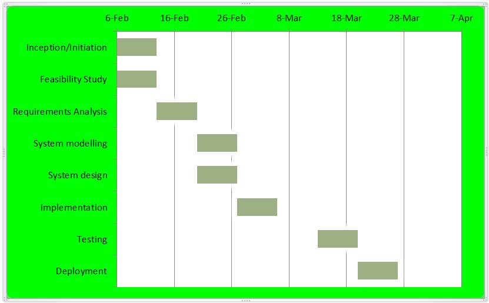

# Feasibility Study

## Project Plan

This project is aimed at designing and developing a web based patient record management system. The stages and time frames to be taken or the project plan is illustrated in the Gantt chart below:

*Figure 2.0: Gantt Chart.*

## Feasibility Study

It is the evaluation of the practicality and desirability of a proposed project or system. It takes into consideration all the relevant factors such as technical, legal, operational, and scheduling.

### Operational Feasibility

This feasibility study considers the availability of human resources to operate the system. The patient record management system is custom designed to meet the user requirements and needs and the interface will be user friendly implying that the clinic staff will be able to use the system

### Technical Feasibility

Technical feasibility is the assessment of the technical resources and expertise of the project. It determines whether there is valid and sufficient technical resources and expertise to design and develop the system. The clinic already has new hardware devices such as iPads and MacBooks. In this case the developer has knowledge about:
•	SQLite to build the database
•	Visual Studio Code to implement the code
•	Unified Modeling Language for modelling and designing

### Economic Feasibility 

Economic Feasibility measures the cost effectiveness of the project which requires a cost benefit analysis. The software used were downloaded from the internet hence no costs where incurred.

Tangible Benefits

+	Reduces data redundancy
+	Data can be backed up and restored
+	Increased throughput
+	Data reliability is ensured
+	Multiple users can share the file at the same time

Intangible benefits

+	Productivity is improved
+	Data integrity and security is achieved
+	It is portable since it is web based and less office space is consumed

Intangible costs

+	Knowledge required to develop the system
+	Time for implementing and adapting the system
+	Training the staff members on the new system

The benefits in this case outweigh the costs hence the project is economically feasible.

### Legal Feasibility

 This project conforms to all the legal and ethical requirements both in the software development and the health sector.

# Requirements analysis

## Survey Report

On the 19th of February 2021 an employee satisfaction survey was carried out at Nyanga Family Clinic focused on 8 of its staff members. The survey was conducted to seek permission from Health professionals to conduct a changeover from a manual/traditional/ paper based system to electronic medical records. It was also conducted to identify factors that could affect implementation and that needed to be considered by the developers. The survey was carried out by means of a questionnaire which has been listed in the appendix. The questionnaire consisted of Demographic/ statistical attributes, the knowledge of the health professionals on electronic medical records and closed ended questions on their (the health professionals) readiness to accept the EMRs.

8 questionnaires were distributed, one for each employee. Of the 8 distributed there was all responded giving a 100% participation rate and a 100% completion rate every question in the questionnaire was responded fully. The last respondent submitted their questionnaire on the 22nd of February, 2021. The statistical views indicated that the age range was from 26- 60 years. 25% have diplomas and below and 75% are degree holders.100% has a working experience of more than 2 years in the medical field. 62.5% are computer literate and have access to computers at home, 37,5% have access to computers at work.  Under the knowledge and attitude of EMRs 50% indicated to have knowledge on EMRs and computer related skills, 37.5% have a previous know how of EMRs.100% have positive feelings towards EMRs and believe that EMRs have importance and will improve service quality, patient satisfaction ,and will save money and time. 100% agreed to have the hardware to support EMR implementation. Finally the readiness section indicated that 75% of the respondents are 92% ready for the new system and 37,5% showed 50% readiness of engagement.

In conclusion the whole survey indicated that training will be necessary upon implementation of basic computer skills and how to navigate across the system. The results displayed also showed that the staff members have a positive attitude towards EMRs and are ready to learn more and use it. This gave the developer an insight of how the end-user thinks and their capabilities of using the system. 

## Software Requrements Specifications (Volere)

SRS is a description of the software or system to be developed.  It will provide a detailed overview of the system whilst indicating its parameters and goals. This section will use the Volere template to outline the software requirements specification of a web based Patient Management Record System. It will cover naming conventions and terminology, Functional and non-functional requirements, Performance requirements, constraints and security requirements.

### Naming Conventions and Terminology

A glossary of terms and names used in this study.

**NFC:**				    Nyanga Family Clinic

**EMR:**				    Electronic Medical Records, these are digitized patient files which are now in electric form

**Patient History:**		Data which includes a patient's problems, medications,allergies, family history, social history, allergies,

**UML**			        Unified Modelling Language, is a standardized modelling language that uses graphic notation to create visual representations of systems

**DDL**				        Data Definition Language,  this is a language used for data definition and modification

**DFD**				        Data Flow diagrams represent the flow of data graphically

**ERD**			        Entity Relationship Diagrams show the relationships between entities in a database

**HL-7 :** 				Health Level Seven standards for interoperability of health information technology.

### The stakeholder
These are individuals with an interest of the product in this case the software.

#### The client
These are the end users of the system.

+ The Admin is the super user of the system who is also the developer.
+ The admin shall create users for the system
+ The admin shall maintain and control updates of the system

#### The receptionist
+ The receptionist shall create patient forms and set appointments

#### The nurse
+ The nurse shall have access rights to the EMRs (read and write)

#### The doctor

+ The nurse shall have access rights to the EMRs (read and write)

### Functional Requirements

These requirements define what the application does (functions,)the processes it has to carry out and the protocols/rules  it functions by.

+	The system will allow users to search for a patient using primary keys (IDs)
+	The system will allow data editing if the user has access rights
+	The system will allow online storage of files
+	The system will allow different users to login using different login credentials
+	The system will enable users to retrieve data based on a certain criteria
+	The system will enable users to create reports
+	The system will abide by the HL-7 standards
+	The system shall be able to calculate medical bills 
+	The system shall be able to print prescriptions

###  Non Functional requirements

#### Appearance Requirements

+	The system will provide a web application user interface that is compatible with the web browser and user friendly.
+	The system will be tailor made it will comply with the branding standards.
+	The interface will have a blueish theme

Fit criterion:

The employees at NFC are novices when it comes to computers hence the interface will suit the user
The system branding shall certify that the product abides with the current standards

#### Performance requirements

+ The system shall operate in real-time, the response timing is instant

Fit Criterion

+ The system will be time conducive and it will save time by reducing the turnaround time.
+ There should be reliable network connection with a large bandwidth

#### Security Requirements

+ The system will be protected by passwords
+ It shall not allow user access unless provided with the correct credentials

Fit Criterion

This will ensure data safety stored in the databases

#### User Documentation and Training

+ The system will come with a clearly written user manual
+ The employees of NFC shall be trained upon implementation

Fit Criterion

The staff members will require training upon implementation

#### Reliability and availability Requirements

+ The system shall be available any time of the day all year round
+ The system shall be accessible anywhere around the globe which provides an internet 

## Use Case

Use case modelling is defined as an important tool for requirements elicitation. It provides a graphical representation of the software system's requirements. It represents the interaction between the user and the system, the user being the actor and the case being the system actions or processes. It is used to capture the dynamic aspect of the system. A use case diagram is shown below in figure 3.2

Actors of the system

+	Administrator
+	Receptionist
+	Nurse
+	Doctor

*Figure 3.1: Use Case Diagram.*

### Use Case Documentation

## Evaluation of Ethical considerations

 Ethical values are universal rules of conduct that provide a practical basis for identifying what kinds of actions, intentions, and motives are valued (Ostman L, 2019). Health records contain both facts and professional opinions on a patient's physical and/or mental health. Consultation notes scan results, videos, audio recordings, photographs, tissue samples and correspondence between professionals all feature in health records. With all this in consideration this system has to be reliable, secure and information should be kept confidential. Respect for patient autonomy requires that patient encounters and information are kept confidential and private; fostering trust and improving communication. (L, 2012) All vital information in the healthcare sector is protected by the Data Protection Act which prescribes ways to address data privacy in the digital world. The following were observed during the development of the patient record management system:

Informed consent: The developer got informed consent to access patient’s records in order to come up with a suitable tailor made system and to be working in their organization abiding by their code of ethics. 

Confidentiality: Confidentiality was observed in all the processes whilst and after handling the medical files.

Anonymity: The people who participated in the research of this study and development of the new system will remain anonymous

The dangers of unethical practices: These will negatively affect the company’s image and reputation since it might result in lawsuits.

