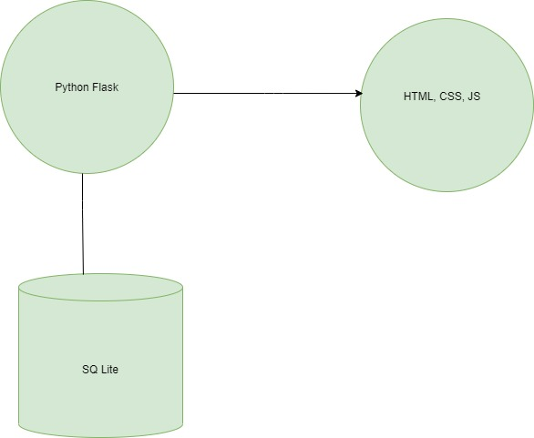

# Inception/Initiation

## Introduction

Health information technology is providing patients, clinicians, and researchers with access to data that will enable novel approaches to science and medicine. Digital health records (DHRs) are capable of being shared across different health care settings for the examination of possible trends and long-term changes in a patient's disease progression or status as well as the effectiveness of the health care delivery system. While prevalence of paper records remains high, there has been a rapid trend toward the digitalization of medical and health records in many countries. This project focuses on the designing, development, testing and implementation of a patient record management system for Nyanga Family Clinic. This chapter focuses on problem definition or inception. It includes the background study, the problem statement, a description of the current and proposed system, the objectives, scope and lifecycle model of the project and lastly the literature review.

## Background Study

Globally, institutions in the private and public sector have fully digitized of their entire enterprise, including digital products, channels, and processes, as well as advanced analytics that enable entirely new operating models. Despite the advancements in e-health in other countries, Zimbabwe has little activity where quality healthcare is inaccessible to most of the population in the country (D.S, 2016).Zimbabwe is still way behind when it comes to the health sector being digitalized, most of the major public hospitals such as the Sally Mugabe Hospital still uses the manual system. “Once complete, the process is expected to result in the digitalization of patients’ records as soon as they seek admission at the first hospital after which the same records can be accessed by subsequent departments at all hospitals, including the consulting doctor, further investigations (x-rays a bonus, the Government will be able to assemble instant full statistics, recording and monitoring different disease burdens using the e-system. Once the system has been successfully implemented at Sally Mugabe Central Hospital, it is expected to be rolled out to other health institutions.” (Gore, 2020). The government is working on digitalizing the public sector but due to the ongoing COVID 19 pandemic, it has been temporarily put on hold. This just applies to public hospitals and rural clinics are not included. Nyanga Family Clinic is a healthcare facility for outpatients currently being run by Mrs. M.G Dambanemuya who is a qualified nurse. It is sited in the central business district of a small tourist resort town of Nyanga in Manicaland Zimbabwe. Since it started in 1990 it has been using the manual/ traditional system for its daily processes which include the documentation, filing system, and accounts are all recorded on paper. 

## The problem Statement

Nyanga Family Clinic has been experiencing bad publicity and reputation due to its inability to deliver services to the public effectively. This is due to the misplacement of patient’s records, the patient’s concerns on the privacy and protection of their files and overwhelming workload to the staff. The loss of patient records or misplacement of files is a serious offence and unacceptable in the health sector so it results in losing patients to other clinics or bad publicity. Therefore the purpose of this project is to create a web based Patient record management system. 

## Proposed System

*Figure 1: An overview of proposed system.*

I propose to develop an Electronic Patient Records (EPR) software application. The software will be a web-based application developed using the Python Flask Web Framework. I will rely on modern front-end HTML, CSS, and JavaScript to build the user interface. The web application will also comprise a database back-end system developed in SQLlite. Figure 1 provides a general overview of the software system.

## Objectives of the project:

### Primary objectives

+ To develop a digital health system with an interface and database to store patients’ records
+ To computerize the billing system and automate billing systems

### Secondary objectives
+ To provide more secure and efficient data storage and instant access to records
+ To enable data-driven decision making

## Scope of the project
 
This study is focused on designing a web based online patient record management system. The system will be made specifically for implementation at Nyanga Family Clinic. 

### Assumptions
+ That the doctors and staff are capable of using the system
+ That the staff members are ready to migrate to a computerized system
+ That the clinic has reliable internet connectivity

### Limitations
The software system is web-based and cannot be accessed without an internet connection. Since the software is web-based, it is also slower compared to local server-based or desktop applications.

## Lifecycle model

The developer will use the agile lifecycle model since this project/ system is solely based on iterative and incremental development to satisfy customer requirements and needs. The software created should be highly responsive to customer feedback.  When the software is developed it is tested and taken to be reviewed by the customer if it fails to meet the customer’s requirements the developer has to fix or redevelop the software. Below is a diagram illustrating agile development model:

*Figure 1.1: Illustration of Agile Development Model.*
[Source](http://www.aditicorp.com/services/agile-methodology-based-services/)
