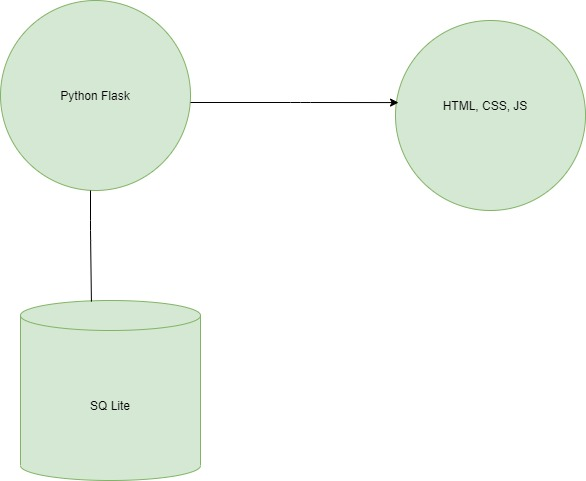
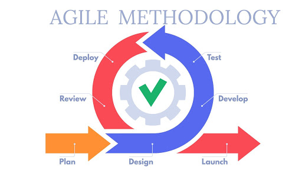
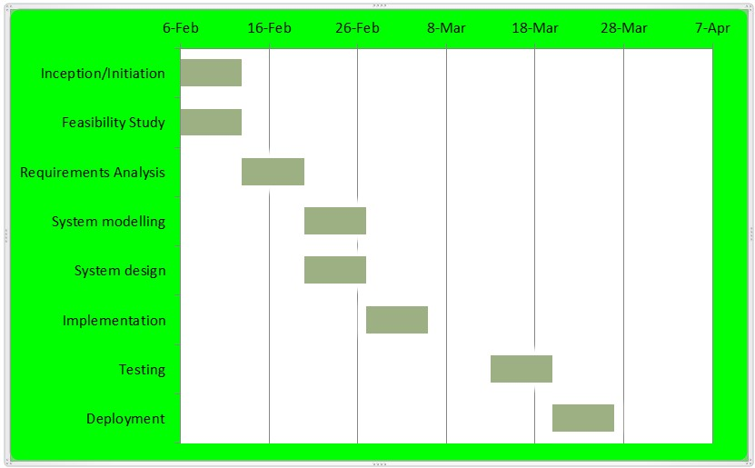

# Introduction

Nyanga Family Clinic was founded in 1989 by the late Dr H.K Dambanemuya. It was situated at Mangondoza Township in Nyanga and later moved to Rochdale the central business district at which it is currently sited. It was founded because there was no private practitioner in the whole of Nyanga district and at some point there was no doctor at the general hospital resulting in the community travelling at least 100 kms for consultation. Nyanga family clinic is a general practice hence everyone is the target population especially the Nyanga District residents. Every patient first sees a general practitioner before getting to a specialist. It offers services such as consultation, Family planning services and counselling, scaling, antenatal care but no deliveries and scanning services. It is registered under the Ministry of Health and has been fully functional since 1989. It is currently being run by Sister Damba who is a qualified nurse and Doctor T.T Chiramba.

## Mission Statement 

Providing the best patient care by treating patients as family with sensitivity and empathy

## Purpose

To cover primary care needs for outpatients in the community dedicated to healing and excellence

# Project Name and Description

The project name is going to be Patient Record Management System. It will be a process of creating a database for patient’s files with different access rights with a user friendly user interface. The nurse and doctor would be having access to the patients’ history, diagnosis and prescription whilst the receptionist would just be able to access basic information such as the person’s address, name, and payment details. It will improve data storage access and enable data driven decision making such as daily reports.

# Problems of the Current System

The current system is a manual or traditional filing system, everything is paper based. Nyanga family clinic was founded in 1990, making it 30 years old. In the health sector patient information is very confidential and vital, meaning it should be kept safe and should be readily available. Since numbers of patients have been accumulating over the years, Storage space has become a problem and some of the papers are now torn and dusty. The file location process is time consuming and tedious because there are a lot of files and they can be easily misplaced as they are more prone to human error. Unauthorized access of files is not restricted since any staff member can just open the file cabinet hence data security is improvised. The main problem with the current system as of recent is that they now have digital scanning systems, Implantable cardiac defibrillator (ICD)  and hardware components such as iPads, and MacBooks which record the information their medical devices and their patient information is still in paper.

# Chapter 1: Inception/Initiation

## Introduction

Health information technology is providing patients, clinicians, and researchers with access to data that will enable novel approaches to science and medicine. Digital health records (DHRs) are capable of being shared across different health care settings for the examination of possible trends and long-term changes in a patient's disease progression or status as well as the effectiveness of the health care delivery system. While prevalence of paper records remains high, there has been a rapid trend toward the digitalization of medical and health records in many countries. This project focuses on the designing, development, testing and implementation of a patient record management system for Nyanga Family Clinic. This chapter focuses on problem definition or inception. It includes the background study, the problem statement, a description of the current and proposed system, the objectives, scope and lifecycle model of the project and lastly the literature review.

## Background Study

Globally, institutions in the private and public sector have fully digitized of their entire enterprise, including digital products, channels, and processes, as well as advanced analytics that enable entirely new operating models. Despite the advancements in e-health in other countries, Zimbabwe has little activity where quality healthcare is inaccessible to most of the population in the country (D.S, 2016).Zimbabwe is still way behind when it comes to the health sector being digitalized, most of the major public hospitals such as the Sally Mugabe Hospital still uses the manual system. “Once complete, the process is expected to result in the digitalization of patients’ records as soon as they seek admission at the first hospital after which the same records can be accessed by subsequent departments at all hospitals, including the consulting doctor, further investigations (x-rays a bonus, the Government will be able to assemble instant full statistics, recording and monitoring different disease burdens using the e-system. Once the system has been successfully implemented at Sally Mugabe Central Hospital, it is expected to be rolled out to other health institutions.” (Gore, 2020). The government is working on digitalizing the public sector but due to the ongoing COVID 19 pandemic, it has been temporarily put on hold. This just applies to public hospitals and rural clinics are not included. Nyanga Family Clinic is a healthcare facility for outpatients currently being run by Mrs. M.G Dambanemuya who is a qualified nurse. It is sited in the central business district of a small tourist resort town of Nyanga in Manicaland Zimbabwe. Since it started in 1990 it has been using the manual/ traditional system for its daily processes which include the documentation, filing system, and accounts are all recorded on paper. 

## The problem Statement

Nyanga Family Clinic has been experiencing bad publicity and reputation due to its inability to deliver services to the public effectively. This is due to the misplacement of patient’s records, the patient’s concerns on the privacy and protection of their files and overwhelming workload to the staff. The loss of patient records or misplacement of files is a serious offence and unacceptable in the health sector so it results in losing patients to other clinics or bad publicity. Therefore the purpose of this project is to create a web based Patient record management system. 

## Proposed System

*Figure 1: An overview of proposed system.*

I propose to develop an Electronic Patient Records (EPR) software application. The software will be a web-based application developed using the Python Flask Web Framework. I will rely on modern front-end HTML, CSS, and JavaScript to build the user interface. The web application will also comprise a database back-end system developed in SQLlite. Figure 1 provides a general overview of the software system.

## Objectives of the project:

### Primary objectives

+ To develop a digital health system with an interface and database to store patients’ records
+ To computerize the billing system and automate billing systems

### Secondary objectives
+ To provide more secure and efficient data storage and instant access to records
+ To enable data-driven decision making

## Scope of the project
 
This study is focused on designing a web based online patient record management system. The system will be made specifically for implementation at Nyanga Family Clinic. 

### Assumptions
+ That the doctors and staff are capable of using the system
+ That the staff members are ready to migrate to a computerized system
+ That the clinic has reliable internet connectivity

### Limitations
The software system is web-based and cannot be accessed without an internet connection. Since the software is web-based, it is also slower compared to local server-based or desktop applications.

## Lifecycle model

The developer will use the agile lifecycle model since this project/ system is solely based on iterative and incremental development to satisfy customer requirements and needs. The software created should be highly responsive to customer feedback.  When the software is developed it is tested and taken to be reviewed by the customer if it fails to meet the customer’s requirements the developer has to fix or redevelop the software. Below is a diagram illustrating agile development model:

*Figure 1.1: Illustration of Agile Development Model.*
[Source](http://www.aditicorp.com/services/agile-methodology-based-services/)

## Literature Review

Definition: According to Michael Coffta a literature review is a comprehensive summary of previous research on a topic. The literature review surveys scholarly articles, books, and other sources relevant to a particular area of research.

+ Hospitals have been using Electrical Medical Records (EMRs) for laboratory and radiologic reports, radiologic images, medication lists, and some decision-support functions are available in electronic format. Some systems have even upgraded their information to an electronic-records system by adding functionalities, such as computerized provider-order entry, physicians' notes, and nursing assessments. However, these functionalities are typically more difficult to implement, and it remains unclear whether hospitals will be able to do so successfully. EMRs have are a key factor for improving healthcare quality and safety, reducing adverse events for patients, decreasing costs, optimizing processes, improving clinical research and obtaining best clinical performances. However, hospitals continue to experience resistance from professionals to accepting EMRs. “Most hospitals that had adopted electronic-records systems identified financial factors as having a major positive effect on the likelihood of adoption: additional reimbursement for electronic health record use (82%) and financial incentives for adoption (75%). Other facilitators of adoption included the availability of technical support for the implementation of information technology (47%) and objective third-party evaluations of electronic health record products (35%). Hospitals with and those without electronic-records systems were equally likely to cite these factors (P>0.10 for each comparison)” (Placeholder1) (Anna De Benedictis, 2020).
The developer will develop a web based Electronic Medical record system which focuses on patient record management for storing outpatients’ files and will use the parallel changeover method for implementation for doctors to have time to adapt and get used to the system as they’ll see for themselves that the benefits of using an EMR system.

+ Digitalization can bring a paradigm swing in traditional healthcare systems by minimizing medical errors, promoting healthcare quality, reducing healthcare costs and empowering patients to take care of their medical needs (Catwell .L, 2009). Despite the advancements in e-health in other countries, Zimbabwe has little activity where quality healthcare is inaccessible to most of the population in the country (D.S., 2016). Consequently, several technology introductions in Zimbabwe are mainly customized to each hospital and do not communicate with each other. Zimbabwe has very few hospitals that are fully digitalized. According to a study conducted by Samuel S. Furusa and Alfred Coleman on the topic;  Factors influencing e-health implementation by medical doctors in public hospitals in Zimbabwe, the following factors contribute to the why the healthcare sector of Zimbabwe is not yet digitalized:

+	The lack of technology infrastructure and funding to get the devices, 
+	Most clinicians are technical novices, they do not have adequate ICT skills and knowledge
+	Most hospitals do not have an IT department hence resulting in lack of technical support
+	Security  concerns, the violation of doctor patient confidentiality was an issue of concern pertaining to who had access to the system
+	Resistance to change, most clinicians are now accustomed to the manual system arguing that digitalized systems are more difficult to use
+	Lack of basic medical facilities, hospitals lack basic equipment that an advancement in technology will be a luxury

Therefore Digitization makes it easier for patients and healthcare professionals to remain on the same page. Gone are the days when the patients had to maintain a thick medical records file they needed to bring to every medical appointment. Particularly with medical emergencies, patient history is at the mercy of the attendants who may or may not be well-versed with the patient’s profile. Digitization has leveled this platform to keep both patients and their doctors well informed of every situation.

# Chapter 2:Feasibility Study

## Project Plan

This project is aimed at designing and developing a web based patient record management system. The stages and time frames to be taken or the project plan is illustrated in the Gantt chart below:

*Figure 2.0: Gantt Chart.*

## Feasibility Study

It is the evaluation of the practicality and desirability of a proposed project or system. It takes into consideration all the relevant factors such as technical, legal, operational, and scheduling.

### Operational Feasibility

This feasibility study considers the availability of human resources to operate the system. The patient record management system is custom designed to meet the user requirements and needs and the interface will be user friendly implying that the clinic staff will be able to use the system

### Technical Feasibility

Technical feasibility is the assessment of the technical resources and expertise of the project. It determines whether there is valid and sufficient technical resources and expertise to design and develop the system. The clinic already has new hardware devices such as iPads and MacBooks. In this case the developer has knowledge about:
•	SQLite to build the database
•	Visual Studio Code to implement the code
•	Unified Modeling Language for modelling and designing

### Economic Feasibility 

Economic Feasibility measures the cost effectiveness of the project which requires a cost benefit analysis. The software used were downloaded from the internet hence no costs where incurred.

Tangible Benefits

+	Reduces data redundancy
+	Data can be backed up and restored
+	Increased throughput
+	Data reliability is ensured
+	Multiple users can share the file at the same time

Intangible benefits

+	Productivity is improved
+	Data integrity and security is achieved
+	It is portable since it is web based and less office space is consumed

Intangible costs

+	Knowledge required to develop the system
+	Time for implementing and adapting the system
+	Training the staff members on the new system

The benefits in this case outweigh the costs hence the project is economically feasible.

### Legal Feasibility

 This project conforms to all the legal and ethical requirements both in the software development and the health sector.

# Chapter 4: System Modeling

## System models

System modeling is the process of developing abstract models of a system, with each model presenting a different view or perspective of that system (Sommervile, 2016).It helps the analyst understand the functionality of the system and models are used to communicate with the customers.

## Logical Data Modeling

This defines how the system should be implemented regardless of the Database Management System, It gives a clearly detailed description of data regardless of the way it will be physically implemented. below is a description of etities and their attributes

*Figure 2.0: A description of entities and their attributes.*

## Entity Relationship Diagram

The diagram below describes in detail the entities involved and the relationships between these entities.

*Figure 2.0: Entity Relationship Diagram.*

## Data Flow Diagrams

In this section there is going to be the context diagram for the general outlook and level 0 diagrams to illustrate the functions of the receptionist, administrator and doctor. Below is a data dictionary for the data flow diagrams:

*Figure 2.0: A data dictionary for data flows.*

*Figure 2.0: Contextual diagram.*

*Figure 2.0: Receptionist DFD .*

*Figure 2.0: : Doctor’s Data Flow Diagram.*

*Figure 2.0: : Administrator’s Data Flow diagram.*

## Class diagrams

This is a representation in the Unified Modeling Language (UML) is a type of static structure diagram that describes the structure of a system by showing the system's classes, their attributes, operations (or methods), and the relationships among objects.

*Figure 2.0: Class diagram.*

# Chapter 5

## Interface design

The interface was designed as a Graphic User Interface since it makes use of Windows, Icons, Menus and pointers. This was the best option since it is user friendly and easy to navigate. It is illustrated in figure 5.1 below:

*Figure 5.1: Interface Design.*

## Menu Design

The system has a main menu with the standard horizontal design at the top right corner which consists of links to the Search page, New Patient, About page and Logout Page. These can only be accessed when a user logs in to the system with correct credentials. The Menu Page also shows the number of treated patients, number patients still waiting and pending appointments as shown in fig 5.2 below.

*Figure 5.2: Menu Design.*

## System Architecture

The system has to be authorized by the ministry of health so that they ensure privacy and security so as to authenticate the system before use. Once permission is granted the user accesses the system through the interface designed. Patients’ files are stored in a database located in the cloud. All backups are done on the cloud as shown in fig 5.3 below.

*Figure 5.3: System Architecture.*

## Model Design

Modules of the proposed application includes the Login Model, The index/Menu, the  search page, the new patient, and logout page.

*Figure 5.4: Login Page.*

*Figure 5.5: Search Page.*

*Figure 5.6: New Patient Page.*

*Figure 5.6: About/Contact Page.*

# Chapter 6

## Program flowchart

This is a diagrammatic representation of the flow of activities in the system from logging in to logging out. A user logs into the system. If the credentials are correct then the menu page is loaded else an error message pops up. When a patient enters the clinic, the receptionist searches for the patients’ file if found then they proceed to enter the patient’s details if else they add a new patient file and save the file. Then finally logout. As illustrated in figure 6.1 below:

*Figure 5.6: Program flowchart.*

## Code

The code of the working system is included in the link below:

# Bibliography

Anna De Benedictis, E. L. (2020). Elctronic Medicl Records implementation in hospitals: An investigation of indivisual and organisational determinants. PLOS .

Catwell .L, S. A. (2009). Evaluating e-health interventions: The need for continuous systemic evaluation. PLoS medicine, 1-6.

D.S, C. (2016). Potential/preparedness of e-health services in Zimbabwe. International Journal of Research in IT and Management, 26-30.

D.S., C. (2016). Potential/Preparedness of e-health services in Zimbabwe. International Journal of Research in IT and management, 26-30.

Gopal, G., & Clemens Suter-Crazzalara, L. T. (2018). Digital transformation in health-care -architectures of present and future information technologies. Clinical Chemistry and Laboratory Medicine, 9-10.

Gore, P. C. (2020, January 24). Public Hospitals go digital. The Herald, p. 3.

